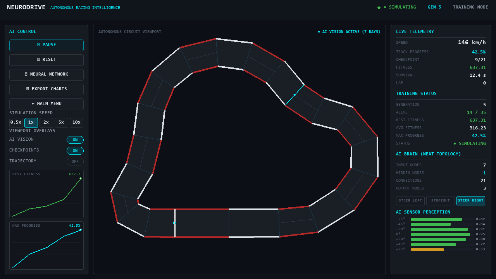
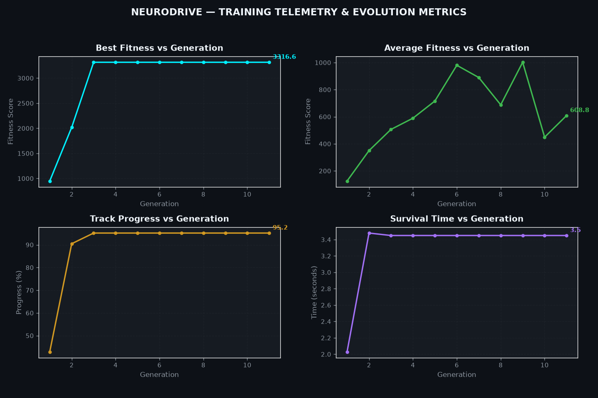
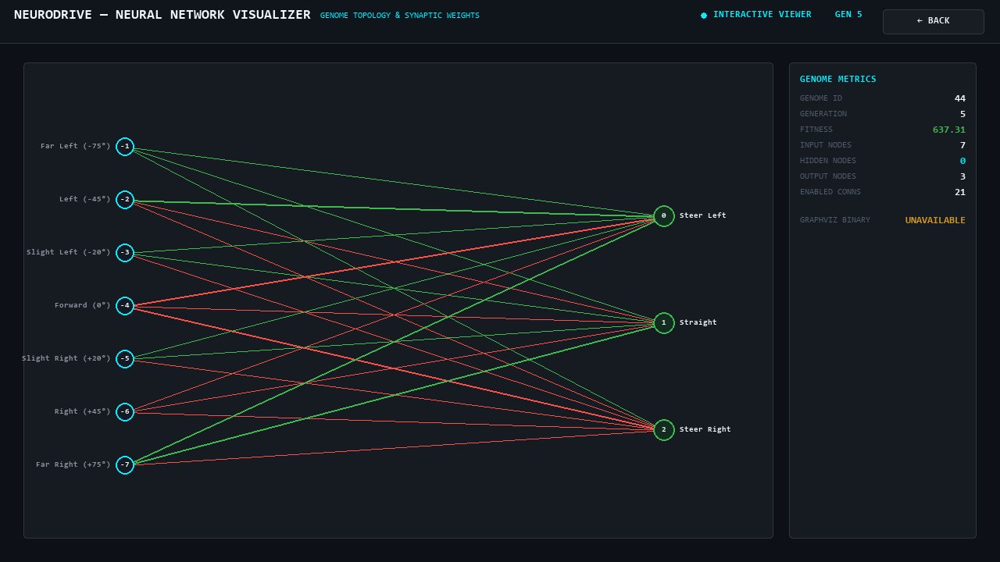

# NeuroDrive — Autonomous Racing AI



> **Autonomous Racing Intelligence powered by NEAT (NeuroEvolution of Augmenting Topologies).**  
> Built with pure Python, Pygame, NumPy, and Matplotlib.

---

## Overview

**NeuroDrive** is an autonomous vehicle research simulation where artificial neural networks learn to navigate complex racing circuits through Darwinian neuroevolution. Rather than relying on hardcoded waypoints, pre-recorded driving paths, or hand-tuned heuristics, the vehicle's driving behavior evolves organically across generations.

The project demonstrates genuine artificial intelligence:
- **Zero Hardcoded Paths**: The vehicle has no concept of an optimal racing line until it discovers it.
- **Genuine Evolution**: Synaptic weights and network topologies mutate, speciate, and recombine.
- **Real Perception**: Geometric 7-ray perception suite calculates real-time distances to circuit boundaries.
- **Deterministic 2D Physics**: Angular kinematics, forward acceleration, rolling friction, and steering dynamics.
- **F1 Telemetry Interface**: Research lab HUD displaying speed, survival time, real-time sensor readings, live sparklines, and active neural activations.

---

## Key Features

- **Autonomous NEAT Neuroevolution**: Implements the NEAT algorithm to evolve both connection weights and hidden topology structures (nodes and synapses) simultaneously.
- **7-Ray Geometric Perception**: Ray-casting sensor suite calculating exact boundary intersections with dynamic danger/warning/clear color gradients.
- **FIA GP-Style Racing Circuit**: Features high-speed straights, technical chicanes, 180° hairpin turns, alternating red/white kerbs, and sequential checkpoints.
- **Interactive Multi-Speed Simulation**: Real-time speed scaling (0.5x, 1x, 2x, 5x, 10x) with instant pause/resume, reset, and feature toggles.
- **Model Persistence**: Serializes champion genomes, generation milestones, and metadata via Python `pickle` for instant loading and reproduction.
- **Inference Mode**: Runs the trained champion autonomously without population clutter.
- **Topology Visualizer**: In-app interactive neural visualizer displaying input sensors, evolved hidden nodes, outputs, and synaptic weights, with Graphviz export capability.
- **Automated Analytics Engine**: Generates publication-ready dark-mode telemetry charts via Matplotlib (Best Fitness, Average Fitness, Track Progress, and Survival Time).

---

## Technology Stack

| Component | Technology | Purpose |
| :--- | :--- | :--- |
| **Language** | Python 3.10+ | Core application runtime and logic |
| **Simulation & Graphics** | Pygame-CE (Community Edition) | 2D physics simulation, vector vehicle graphics, and HUD |
| **Neuroevolution** | NEAT-Python | Genetic algorithm, speciation, and topology evolution |
| **Mathematics & Geometry** | NumPy / Pygame Math | Ray-casting vector algebra and parametric line intersection |
| **Analytics & Plotting** | Matplotlib | Generational telemetry curves and training analytics |
| **Network Visualization** | Graphviz / Native Pygame | Synaptic graph diagrams and interactive in-app visualizer |

---

## System Architecture

```
neurodrive/
├── main.py                     # Master application entry point and mode router
├── config.py                   # Centralized configuration (physics, sensors, UI colors)
├── config-feedforward.txt      # NEAT genetic algorithm hyperparameters
├── requirements.txt            # Project dependencies
├── README.md                   # Comprehensive documentation
│
├── game/                       # Core simulation and vehicle kinematics
│   ├── __init__.py
│   ├── physics.py              # 2D vehicle dynamics, acceleration, friction, steering
│   ├── car.py                  # Vehicle entity, vector drawing, telemetry states
│   ├── track.py                # GP circuit geometry, boundaries, kerbs, centerline
│   ├── sensors.py              # 7-directional geometric ray-casting perception suite
│   ├── checkpoint.py           # Sequential checkpoints and lap tracking
│   └── collision.py            # Vehicle polygon vs. wall boundary intersection
│
├── ai/                         # Machine learning and neuroevolution
│   ├── __init__.py
│   ├── agent.py                # AIAgent bridging NEAT network to vehicle physics
│   ├── fitness.py              # Anti-exploit fitness evaluation formulation
│   ├── evolution.py            # Population lifecycle and generational metric recorder
│   ├── training.py             # Live training session and inference orchestrators
│   └── model.py                # Model persistence (save/load pickle checkpoints)
│
├── ui/                         # Premium "Research Lab + Telemetry" interface
│   ├── __init__.py
│   ├── theme.py                # Typography, color constants, card panels, borders
│   ├── controls.py             # Interactive buttons, toggles, and speed selector
│   ├── telemetry.py            # Live HUD, sensor bars, AI brain metrics, crash alerts
│   ├── charts.py               # Embedded real-time sparkline trend charts
│   ├── dashboard.py            # Master layout coordinator for racing viewport
│   └── landing.py              # Minimalist landing screen with feature cards
│
├── visualization/              # Topology diagrams and research analytics
│   ├── __init__.py
│   ├── neural_network.py       # Graphviz export and in-app neural network visualizer
│   └── analytics.py            # Matplotlib multi-panel generational telemetry plots
│
├── models/                     # Saved champion genomes (best_agent.pkl)
├── data/                       # Track definition caches
└── outputs/                    # Generated charts and network diagrams
```

---

## How the AI Works

The agent navigates the track through an autonomous continuous closed-loop learning cycle:

```
┌────────────────────────────────────────────────────────┐
│                   RACING ENVIRONMENT                   │
│          (Track Boundaries & Checkpoints)              │
└───────────────────────────┬────────────────────────────┘
                            │ Ray-Casting Intersections
                            ▼
┌────────────────────────────────────────────────────────┐
│                 PERCEPTION (7 SENSORS)                 │
│         Normalized distances [0.0, 1.0]                │
└───────────────────────────┬────────────────────────────┘
                            │ Normalized Inputs
                            ▼
┌────────────────────────────────────────────────────────┐
│                 NEAT NEURAL NETWORK                    │
│      Evolved Topology (Inputs -> Hidden -> Outputs)    │
└───────────────────────────┬────────────────────────────┘
                            │ Argmax Activation
                            ▼
┌────────────────────────────────────────────────────────┐
│                   ACTION SELECTION                     │
│          [0: Steer Left, 1: Straight, 2: Steer Right]  │
└───────────────────────────┬────────────────────────────┘
                            │ Kinematic Updates
                            ▼
┌────────────────────────────────────────────────────────┐
│                   VEHICLE PHYSICS                      │
│        Velocity, Heading Angle, Position Shift         │
└───────────────────────────┬────────────────────────────┘
                            │ Performance Evaluation
                            ▼
┌────────────────────────────────────────────────────────┐
│                   FITNESS EVALUATION                   │
│  Checkpoints (+100), Speed (+0.08), Crash (-35), Laps  │
└───────────────────────────┬────────────────────────────┘
                            │ Generational Selection
                            ▼
┌────────────────────────────────────────────────────────┐
│                 DARWINIAN EVOLUTION                    │
│ Speciation, Crossover, Structural & Weight Mutations   │
└───────────────────────────┬────────────────────────────┘
                            │
                            └────► Next Generation Population
```

---

## State Representation (7 Inputs)

The AI perceives the circuit through 7 directional ray-casting distance sensors arranged relative to the vehicle's heading:

| Input Index | Relative Angle | Perception Vector | Meaning of Normalized Value |
| :---: | :---: | :--- | :--- |
| **0** | -75.0° | Far Left | 1.0 = Clear road; 0.0 = Imminent left barrier impact |
| **1** | -45.0° | Left | Approach angle for left turn entry |
| **2** | -20.0° | Slight Left | Forward-left proximity |
| **3** | 0.0° | Forward (Direct) | Straightaway visual horizon |
| **4** | +20.0° | Slight Right | Forward-right proximity |
| **5** | +45.0° | Right | Approach angle for right turn entry |
| **6** | +75.0° | Far Right | 1.0 = Clear road; 0.0 = Imminent right barrier impact |

---

## Action Space (3 Outputs)

The neural network outputs 3 activation values. The agent executes the discrete action corresponding to the highest output ($\text{argmax}$):

| Action Index | Output Action | Mechanical Response |
| :---: | :--- | :--- |
| **0** | `STEER LEFT` | Heading rotated counter-clockwise by $\Delta\theta = 4.2^\circ \cdot \sqrt{v / v_{\max}}$ |
| **1** | `STRAIGHT` | Heading maintained; forward acceleration applied |
| **2** | `STEER RIGHT` | Heading rotated clockwise by $\Delta\theta = 4.2^\circ \cdot \sqrt{v / v_{\max}}$ |

---

## Fitness Function & Exploit Mitigation

The fitness function is mathematically formulated to incentivize aggressive, safe racing while eliminating loops, stalling, and wall-riding exploits:

$$\text{Fitness} = \sum_{t=0}^{T} \left( w_{\text{surv}} + v_t \cdot w_{\text{speed}} \right) + N_{\text{cp}} \cdot W_{\text{cp}} + N_{\text{lap}} \cdot W_{\text{lap}} + \text{Penalty}_{\text{crash}}$$

### Parameters:
- $W_{\text{cp}} = +100.0$: Awarded only upon crossing the next sequential checkpoint ($i \to i+1$).
- $W_{\text{lap}} = +1200.0$: Major bonus for completing a full 21-checkpoint circuit.
- $w_{\text{speed}} = 0.08$: Encourages high velocity rather than slow creeping.
- $w_{\text{surv}} = 0.04$: Minor reward for maintaining presence on track.
- $\text{Penalty}_{\text{crash}} = -35.0$: Imposed immediately upon boundary impact.
- **Idle Stagnation Disqualification**: If an agent fails to reach the next sequential checkpoint within **140 frames**, it is terminated immediately.
- **Reverse Driving Prevention**: Checkpoints only register in the forward track direction. Reversing or circling around a single checkpoint yields zero progression.

---

## NEAT (NeuroEvolution of Augmenting Topologies)

Traditional deep reinforcement learning algorithms (like PPO or DQN) optimize weights across a fixed, manually specified neural architecture via gradient descent and backpropagation.

In contrast, **NEAT** optimizes both synaptic weights **and** network structure through evolutionary genetic operators:
1. **Topology Augmentation**: Networks start minimal (7 inputs connected directly to 3 outputs). Mutations randomly add new synapses or insert new hidden nodes into existing connections.
2. **Historical Markings (Innovation Numbers)**: Solves the competing conventions problem by tracking the historical origin of every gene, enabling meaningful crossover between different network topologies.
3. **Speciation**: Genomes are grouped into species based on topological compatibility distance. This protects innovative structural additions (which may initially reduce fitness) from immediate extinction before they have time to optimize.

---

## Installation

### Prerequisites
- Python 3.10 to 3.14
- Operating System: Windows, macOS, or Linux

### Install Dependencies
Clone the repository and install the verified dependencies:

```bash
git clone https://github.com/your-username/neurodrive.git
cd neurodrive
python -m pip install -r requirements.txt
```

*(Note: `requirements.txt` installs `pygame-ce`, `neat-python`, `matplotlib`, `numpy`, and `graphviz`)*.

---

## Running NeuroDrive

### 1. Launch Landing Screen (Default)
Starts the application at the interactive landing screen with feature cards and mode buttons:
```bash
python main.py
```

### 2. Launch Directly into Training Mode
Starts NEAT population evolution immediately in the racing dashboard:
```bash
python main.py --mode train
```

### 3. Launch Inference Mode
Loads the saved champion genome from `models/best_agent.pkl` and demonstrates autonomous driving:
```bash
python main.py --mode inference
```

### 4. Launch Neural Network Visualizer
Inspects the evolved champion genome's topology, hidden nodes, and connection weights:
```bash
python main.py --mode visualize
```

### 5. Custom Resolution (e.g. 1080p Full HD)
```bash
python main.py --width 1920 --height 1080
```

---

## Interactive Dashboard Controls

| Control | Action | Shortcut |
| :--- | :--- | :---: |
| **PAUSE / RESUME** | Pauses or resumes simulation execution | `SPACE` |
| **RESET** | Resets population and restarts evolution from Generation 1 | — |
| **NEURAL NETWORK** | Opens live visualizer showing synaptic connections and weights | — |
| **EXPORT CHARTS** | Exports high-resolution generational charts to `outputs/` | — |
| **AI VISION** | Toggles 7-ray perception visualization on/off | `V` |
| **CHECKPOINTS** | Toggles checkpoint gate lines on/off | — |
| **TRAJECTORY** | Toggles vehicle breadcrumb trail on/off | — |
| **SPEED SELECTOR** | Accelerates simulation: `0.5x`, `1x`, `2x`, `5x`, `10x` | — |
| **MAIN MENU** | Returns to the landing screen | `ESC` |

---

## Generational Analytics

NeuroDrive automatically tracks real, un-faked generational metrics during training:
1. **Best Fitness vs Generation**
2. **Average Fitness vs Generation**
3. **Track Progress (%) vs Generation**
4. **Survival Time (s) vs Generation**



Charts can be exported at any time by clicking **EXPORT CHARTS** or calling `generate_analytics_plots()`. Figures are saved to `outputs/training_analytics.png`.

---

## Neural Network Topology Visualization



The built-in interactive visualizer renders:
- **7 Sensor Input Nodes**: Clearly labeled with relative beam angles.
- **Hidden Nodes**: Evolved topological nodes assigned actual NEAT node keys.
- **3 Output Nodes**: Steering actions (`Steer Left`, `Straight`, `Steer Right`).
- **Synapses**: Green lines for positive weights, crimson lines for negative weights, with thickness scaled to $|w|$.
- **Graphviz System Integration**: If the Graphviz `dot` binary is present on your system PATH, a vector PNG is automatically exported to `outputs/neural_network.png`. If unavailable, the in-app visualizer operates independently without dependencies.

---

## Future Enhancements

- **Dynamic Weather & Grip**: Wet track conditions with dynamic friction coefficients.
- **Multi-Track Selection**: Additional circuits featuring Suzuka-style crossovers and Monaco tight chicanes.
- **Adversarial Multi-Agent Racing**: Direct agent-to-agent collision physics allowing pack racing and drafting.
- **Continuous Steering Control**: Continuous steering angle output via hyperbolic tangent activation.
- **Comparative AI Benchmarks**: Head-to-head evaluation against Deep Q-Networks (DQN) and Proximal Policy Optimization (PPO).
